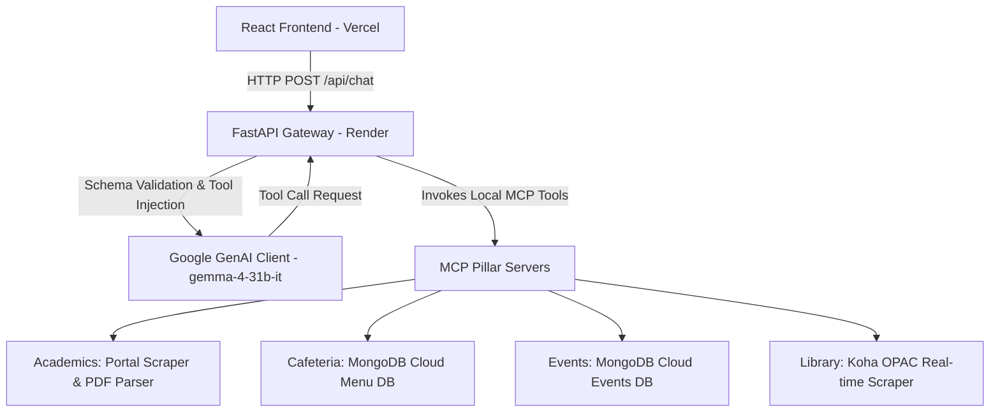

# Unified Campus Intelligence Dashboard with AI Assistant

An integrated AI assistant gateway for IIT Roorkee students built with FastAPI, React + Vite, and supported by autonomous Model Context Protocol (MCP) services. The AI is powered by the `gemma-4-31b-it` model to orchestrate tool calling across academics, cafeteria, events, and library systems.

---

## 🏗️ Architecture Overview

The system consists of three main layers working together in real-time:



1. **Frontend (Vercel):** A premium, minimalist blue-and-white chat dashboard styled with modern CSS, offering role-based login selection (Student vs Admin), profile context persistence, and collapsable backend trace logs.
2. **API Gateway (Render / Railway):** A FastAPI server that registers Python callables dynamically from all 4 MCP sub-servers. It wraps tools in a trace logger to capture backend steps and forwards requests to Gemini/Gemma securely.
3. **MCP Services (Intranet & Database):** Specialized micro-applications that query databases or scrape live portals to get real-time info.

---

## 📂 Project Folder Structure

```
Unified-Campus-Intelligence-Dashboard-with-AI-Assistant/
├── server.py              # Main FastAPI gateway, imports MCP servers and calls Gemini Client
├── requirements.txt       # Unified Python dependencies list for production deployment
├── .gitignore             # Configured to ignore secret environment files, caches, and envs
├── academics/             # Academic calendar scraper
│   ├── main.py            # Academic MCP server (Scrapes portal & parses PDF schedules)
│   ├── pyproject.toml     # Academics package metadata
│   └── uv.lock
├── cafeteria/             # Cafeteria menu server
│   ├── main.py            # Cafeteria MCP server (CRUD operations on MongoDB Atlas Menu DB)
│   ├── pyproject.toml
│   └── uv.lock
├── events/                # Campus events server
│   ├── main.py            # Events MCP server (CRUD operations on MongoDB Atlas Events DB)
│   ├── pyproject.toml
│   └── uv.lock
├── library/               # Library catalog server
│   ├── main.py            # Library MCP server (Parses Koha OPAC RSS search feeds and item tables)
│   ├── pyproject.toml
│   └── uv.lock
└── frontend/              # Frontend Web Application
    ├── package.json
    ├── vite.config.js     # React Dev & Build Tool Config
    ├── index.html
    └── src/
        ├── main.jsx       # App entry point
        ├── App.jsx        # Premium minimalist chat UI & context editor
        ├── App.css
        └── index.css      # Core theme variables (Blue & White stylesheet)
```

---

## 🔐 Role-Based Access Control (RBAC)

The application supports two user profiles selectable at login:
* **🎓 Student Profile (Read-Only):** Can query calendar deadlines, check cafeteria menus, search library books, and list events. If a student attempts to request a write action (such as changing menus or posting events), the gateway blocks the request and returns a `Permission Denied` warning message.
* **🛡️ Admin Profile (Read & Write):** Full administration privileges. Can execute database modifications, add events, and update cafeteria menus.


---

## 📦 Python & Node.js Packages Used

### Core Backend & Web API
* **`fastapi` / `uvicorn`**: High-performance ASGI web framework and server for hosting the API Gateway.
* **`pydantic`**: Data validation and payload settings definitions.
* **`python-dotenv`**: Loads local credentials and URLs securely from `.env` files.

### AI Engine
* **`google-genai`**: Official Google SDK used to connect to the developer API, pass schemas, and orchestrate function calls using the `gemma-4-31b-it` model.

### Database & Scraping (Pillars)
* **`pymongo` / `dnspython`**: Direct MongoDB client drivers to interface with cloud-hosted MongoDB Atlas.
* **`certifi`**: Directs SSL/TLS handshake protocols securely to solve MongoDB verification issues on Windows.
* **`requests` / `httpx`**: Network calls to fetch RSS feeds and download IIT Roorkee portals.
* **`beautifulsoup4`**: Scrapes dynamic HTML from the Mahatma Gandhi Central Library (MGCL) search page.
* **`pypdf`**: Extracts tabular semester registrations, exams, and milestones directly from calendar PDFs.

### MCP (Model Context Protocol)
* **`mcp` / `fastmcp`**: The official protocol wrappers used to build standard, tool-exposing microservices.

### Frontend Web Stack
* **`react` / `react-dom`**: Frontend library.
* **`vite`**: Modern build compiler offering hot-reloads and optimized output builds.

---

## 🌟 Key Features

1. **Intelligent Role Selection & Login Simulation**: Choose between a *Student Profile* and *Admin Console* to test various access scenarios.
2. **Context-Aware Campus Agent**: Persists student context (Program, Major Department, and Academic Cycle Year) and appends this context behind the scenes to yield personalized query results.
3. **Live Academic Calendar Scraper**: Downloads IIT Roorkee's official physical academic PDF schedules and parses table rows in real-time, matching queries with dates/events dynamically.
4. **Interactive Cafeteria & Events Dashboard**: Live menu schedules and upcoming campus event listings backed by MongoDB Atlas. Includes admin privilege checks blocking modification attempts from students.
5. **Real-time Koha OPAC Library Scraper**: Directly queries the Mahatma Gandhi Central Library catalog RSS feeds and tabular records to assess book availability.
6. **Backend Execution Step Trace**: Toggleable step-by-step logs representing Model Context Protocol (MCP) server calls and routing flows.
7. **Mobile-Responsive Side Drawer Interface**: Clean, premium responsive web layout optimizing suggestion grids, roles, and profile modals for smartphone views.

---

## ⚡ Setup & Launch Instructions

### Prerequisites
* **Python 3.10+** (Recommend using `uv` or `pip`)
* **Node.js 18+**

### Backend Setup
1. From the repository root, install the Python package dependencies:
   ```bash
   pip install -r requirements.txt
   ```
2. Create a `.env` file in the root folder with the following configuration:
   ```env
   GEMINI_API_KEY=your_gemini_api_key
   MONGODB_URI=your_mongodb_connection_uri
   ```
3. Boot up the unified FastAPI backend server:
   ```bash
   python server.py
   ```
   *The server runs locally at `http://localhost:8000`.*

### Frontend Setup
1. Navigate into the frontend folder:
   ```bash
   cd frontend
   ```
2. Install the frontend dependencies:
   ```bash
   npm install
   ```
3. Start the Vite React development server:
   ```bash
   npm run dev
   ```
   *The web application runs locally at `http://localhost:5173`.*

---

## 🚀 Deployed Demo Link

The frontend web application is deployed on Vercel:

* **Production URL:** [https://unified-campus-intelligence-dashboa-pi.vercel.app](https://unified-campus-intelligence-dashboa-pi.vercel.app)
* **API Endpoint (Render):** Connects securely to the hosted FastAPI gateway server.

